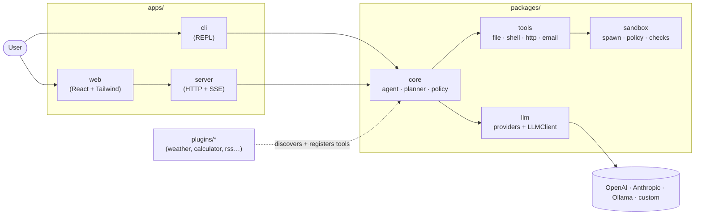

<!-- Hero -->
<div align="center">

```
  ██████╗ ██████╗ ███████╗███╗   ██╗   ██╗  ██╗ █████╗ ███╗   ██╗██████╗
 ██╔═══██╗██╔══██╗██╔════╝████╗  ██║   ██║  ██║██╔══██╗████╗  ██║██╔══██╗
 ██║   ██║██████╔╝█████╗  ██╔██╗ ██║   ███████║███████║██╔██╗ ██║██║  ██║
 ██║   ██║██╔═══╝ ██╔══╝  ██║╚██╗██║   ██╔══██║██╔══██║██║╚██╗██║██║  ██║
 ╚██████╔╝██║     ███████╗██║ ╚████║   ██║  ██║██║  ██║██║ ╚████║██████╔╝
  ╚═════╝ ╚═╝     ╚══════╝╚═╝  ╚═══╝   ╚═╝  ╚═╝╚═╝  ╚═╝╚═╝  ╚═══╝╚═════╝
```

**LLM-agnostic, plugin-first, sandboxed by default.**

[](./LICENSE)
[](https://github.com/ricardo-foundry/openhand/actions/workflows/ci.yml)
[](https://www.typescriptlang.org/)
[](./docs/ERROR_HANDLING.md)
[](https://nodejs.org)
[](https://docs.npmjs.com/cli/v10/using-npm/workspaces)
[](./docker-compose.yml)
[](./CHANGELOG.md)
[](./CHANGELOG.md#070---2026-04-25)
[](./plugins)
[](./packages/llm/src)
[](./cookbook)
[](./bench/README.md)
[](./scripts/runtime-integration.sh)
[](https://github.com/ricardo-foundry/openhand/issues)

[](https://starchart.cc/ricardo-foundry/openhand)

</div>

OpenHand is a small, **opinionated** agent runtime: one provider-neutral LLM
interface, an audited tool layer, a sandbox you can trust with `shell_exec`,
and a plugin system that stays out of core's way. No vendor SDKs, no meta-
framework — just enough framework that you can read the whole `packages/core`
in a weekend.

---

## At a glance

| Axis | Status |
| --- | --- |
| Unit tests | **209** (`npm run test:unit`) — packages/* + apps/*, includes telemetry + doctor + audit |
| Plugin tests | **70** (`npm run test:plugins`) — eight in-tree plugins, each with a `tests/` folder |
| Example tests | **5** (`npm run test:examples`) — runnable cookbook code, asserted by `node:test` |
| Integration tests | **35** (`npm run test:integration`) — provider wire-format (OpenAI / Anthropic / Ollama) + full-agent-flow (server + CLI + SSE) |
| End-to-end tests | **18** (`npm run test:e2e`) — SSE flow, CLI REPL, CLI subcommand spawn, plugin hot-reload, examples runtime (incl. router-worker + streaming-tool-use) |
| Chaos tests | **36** (`npm run test:chaos`) — adversarial: SIGKILL escalation, truncated SSE frames, plugin cycles, shell injection, `NET=none` flips |
| Micro-benchmarks | **10** (`npm run bench`) — LLMClient, plugin loader, SSE ring buffer |
| Total exercised | **383** (single `npm test` from the root) |
| Runtime smoke | **`scripts/runtime-integration.sh`** — build → unit → e2e → bench → examples → CLI → server (one shot, exit 0 on green) |
| TypeScript | **`strict` + `noUncheckedIndexedAccess` + `exactOptionalPropertyTypes` + `noImplicitOverride`** across every workspace, `tsc --noEmit` clean |
| Dependencies in core runtime | **4** (`eventemitter3`, `uuid`, `express`, `cors`). Zero SDK deps. |
| `npm audit` | **0 vulnerabilities** (held since v0.5; verified at every iteration through v0.8-rc) |
| Error policy | [`docs/ERROR_HANDLING.md`](./docs/ERROR_HANDLING.md) — four categories, explicit retry rules |
| Sandbox tests | 31 (policy + sandbox), covering shell-metachar injection, `-c` interpreter flags, path traversal, policy getter |

Run everything with a single `npm test` from the root.

---

## ▶ 60-second Quickstart (zero setup)

```bash
git clone https://github.com/ricardo-foundry/openhand.git && cd openhand
npm install
npx tsx examples/hello-world.ts
```

That's it — three commands. Defaults to `MockProvider`, so **no API key,
no Docker, no Ollama** is required. You'll see a canned reply that proves
the whole pipeline (client → provider → response → usage) works end-to-end.

Want a real backend? Set `LLM_PROVIDER`:

```bash
LLM_PROVIDER=ollama LLM_MODEL=qwen2.5:0.5b npx tsx examples/hello-world.ts
LLM_PROVIDER=openai OPENAI_API_KEY=sk-... npx tsx examples/hello-world.ts
LLM_PROVIDER=anthropic ANTHROPIC_API_KEY=sk-... npx tsx examples/hello-world.ts
```

All three use the exact same code path. See
[`docs/demo-transcript.md`](./docs/demo-transcript.md) for a recorded
zero-setup run.

| I want to…                                  | Read this                                                       |
|---------------------------------------------|------------------------------------------------------------------|
| Try the smallest possible example           | [`cookbook/01-hello-world.md`](./cookbook/01-hello-world.md)     |
| Add my own tool to the agent                | [`cookbook/02-writing-a-plugin.md`](./cookbook/02-writing-a-plugin.md) |
| Use my own LLM (vLLM / LM Studio / Bedrock) | [`cookbook/03-custom-llm-provider.md`](./cookbook/03-custom-llm-provider.md) |
| Confirm the sandbox actually denies things  | [`cookbook/04-sandboxed-shell.md`](./cookbook/04-sandboxed-shell.md) |
| Stream task events into a React app         | [`cookbook/05-streaming-ui.md`](./cookbook/05-streaming-ui.md)   |
| Wire a router → worker multi-agent flow     | [`cookbook/06-multi-agent-orchestration.md`](./cookbook/06-multi-agent-orchestration.md) |
| Stream + tool-use end to end                | [`cookbook/07-streaming-tool-use.md`](./cookbook/07-streaming-tool-use.md) |
| See a mini agent loop (chat → exec → observe) | [`examples/agent-shell-loop.ts`](./examples/agent-shell-loop.ts) |
| Read a full recorded transcript             | [`docs/demo-transcript.md`](./docs/demo-transcript.md)           |
| Read every recipe                           | [`cookbook/README.md`](./cookbook/README.md)                     |

---

## Why OpenHand?

|                              | **OpenHand**                          | AutoGPT                | CrewAI                  | LangChain Agents       |
| ---------------------------- | ------------------------------------- | ---------------------- | ----------------------- | ---------------------- |
| Provider lock-in             | **none** — `LLMProvider` interface    | OpenAI-first           | OpenAI-first            | many, heavy            |
| Sandbox by default           | **yes** — `packages/sandbox`          | no                     | no                      | opt-in                 |
| Hot-reload plugins           | **yes** (`fs.watch`)                  | no                     | no                      | restart                |
| Core LOC you can read        | **small**, auditable                  | large, opinionated     | medium                  | very large             |
| Typing                       | **TS strict** end-to-end              | Python                 | Python                  | Python / JS            |
| Interfaces shipped           | CLI + Web + HTTP server               | CLI                    | SDK                     | SDK                    |

OpenHand is for builders who want **just enough framework** — an agent loop,
tool schema, policy, sandbox, LLM abstraction — and nothing they cannot
delete in a weekend if priorities shift.

---

## What can you actually build with this?

Concrete projects, all under 100 lines of glue, all already runnable today:

1. **Weather bot** — wire the in-tree `plugins/weather` to the REPL, ask
   *"what's the weather in Tokyo?"*, the agent picks the tool and answers.
2. **Code reviewer** — allow `git`, `cat`, `grep` in the sandbox; ask the
   agent to read `git diff HEAD~1..HEAD` and post inline comments.
3. **RSS digest agent** — 60-line plugin (cookbook 02) + 5-minute cron
   pulls Hacker News and pushes a Markdown digest to Slack/Server酱.
4. **Shell automation helper** — sandboxed shell + agent loop = a deploy
   assistant that can `git pull` and `npm test` but cannot `rm -rf`.

See the working scripts in [`examples/`](./examples/).

---

## How it's organized



Apps depend on packages. Plugins are *discovered*, not imported. Providers
are a swap — every provider implements the same `LLMProvider` interface.

See [`docs/ARCHITECTURE.md`](./docs/ARCHITECTURE.md) for the data flow and
boundary rules.

---

## Features

- **Provider-neutral LLM layer** — OpenAI, Anthropic Messages, and Ollama
  ship in-box behind one `LLMProvider` interface, selected at runtime by
  `LLM_PROVIDER=...`. Every wire format is a `fetch` wrapper — no vendor
  SDK, no version drift.
- **`LLMClient` decorator** — exponential-backoff retry, AbortController
  timeouts, FIFO token-bucket rate limiter, accumulating cost tracker.
  Wraps any provider.
- **Sandboxed tool execution** — filesystem, shell, network, and email
  tools all route through `packages/sandbox` with configurable roots,
  timeouts, and output limits. Shell metacharacters and interpreter eval
  flags are rejected at parse time so a confused model can't shell-escape.
- **Policy-gated actions** — allow, deny, or require human approval per
  tool and argument pattern. Pure functions, fully unit-tested.
- **Plugin-first with hot reload** — drop a folder under `plugins/`,
  declare an `openhand` manifest in `package.json`, and `PluginLoader`
  finds it. `loader.watch()` reloads on edits via `fs.watch` (with a 100ms
  retry to ride out half-written files).
- **Interactive CLI REPL** — `openhand chat` gives you `/help`, `/model`,
  `/reset`, `/save`, `/exit`, ANSI spinner, ctrl+c handling, and persisted
  config — all with zero extra deps.
- **Live web task stream** — `GET /api/tasks/:id/stream` is a real SSE
  feed with `Last-Event-ID` resume and a per-task ring buffer.
- **Monorepo with npm workspaces** — `packages/{core,tools,sandbox,llm}`
  and `apps/{cli,server,web}`, each independently testable. **383 tests in total**
  (209 unit + 70 plugin + 35 integration + 18 E2E + 36 chaos + 5 example + 10 benchmark)
  across seven workspaces, all under strict TypeScript, plus a single-shot runtime
  smoke (`scripts/runtime-integration.sh`) that exercises every example, every CLI
  subcommand, and the SSE flow.

---

## Quickstart — full options

### Option A — Docker (web UI + server)

```bash
git clone https://github.com/ricardo-foundry/openhand.git
cd openhand
cp .env.example .env                 # fill in at least one LLM key
docker compose up --build
# Web:    http://localhost:3000
# Server: http://localhost:3001
```

### Option B — Local dev (all workspaces)

```bash
git clone https://github.com/ricardo-foundry/openhand.git
cd openhand
cp .env.example .env
npm install && npm run build
npm run dev                          # CLI + server + web in parallel
```

### Option C — REPL only

```bash
npm --workspace @openhand/cli start
# or, after `npm run build`:
openhand chat
```

Inside the REPL:

```text
> /help
Available commands:
  /help             show this list
  /model <name>     switch model (also accepts "<provider>:<model>")
  /reset            clear history for the current session
  /save             persist config to ~/.openhand/config.json
  /exit             leave the REPL
> /model anthropic:claude-3-5-sonnet-latest
switched to anthropic/claude-3-5-sonnet-latest
> summarize CHANGELOG.md
(spinner...)
```

### Option D — Watch a task from the web UI

```bash
# Terminal 1
npm run dev:server
# Terminal 2
curl -N http://localhost:3001/api/tasks/demo-1/stream &
curl -X POST http://localhost:3001/api/tasks/demo-1/_demo
# -> streams 4 SSE events (pending → running → running → completed)
```

---

## LLMClient — scope and limits

`LLMClient` is convenient but **in-process**:

- The token-bucket rate limiter lives in the JS heap of one Node process.
  Two pods of the same service will each have their own bucket.
- `InMemoryCostTracker` is the same story — per-instance.

That's deliberate: we don't want to ship a Redis dependency in the default
path. For multi-pod deployments where one quota must be shared across
replicas, swap in a Redis-backed bucket and a `costTracker` that writes to
your shared store. Both are single-method interfaces — see
`packages/llm/src/client.ts` for the contracts.

---

## Plugin system

Plugins live in `plugins/*`. Each plugin declares a manifest inside
`package.json` under the `openhand` key, exports tools, and is picked up
automatically at boot:

```text
plugins/calculator/
├── package.json       # { "openhand": { "id": "calculator", "entry": "./index.js" } }
├── index.js           # module.exports = { tools: [...], onEnable() {...} }
├── README.md
└── tests/calculator.test.js
```

Eight example plugins ship in-tree:

- **`plugins/weather`** — minimal mock API to show the shape of a plugin.
- **`plugins/calculator`** — safe arithmetic evaluator (no `eval`, no
  `new Function`) that agents can call for math.
- **`plugins/code-reviewer`** — feed it a unified diff, get back a
  structured Markdown review report.
- **`plugins/rss-digest`** — fetch + summarise RSS feeds; the
  cron-friendly piece of the digest example.
- **`plugins/file-organizer`** — three-tool scan / propose / apply
  flow for tidy file moves under approval.
- **`plugins/git-summary`** — turn a `git log` into a PR description,
  changelog entry, or release-notes block.
- **`plugins/web-scraper`** — SSRF-guarded fetch + cheerio extract +
  LLM-driven structured summary; 16 tests cover SSRF, byte caps,
  header sanitisation, and the full pipeline with a fake LLM.
- **`plugins/code-translator`** — translate a snippet between languages
  with the LLM, then sanity-check by re-parsing the target.

Skip the boilerplate with `npm run plugin:new -- <name>` — it scaffolds
a manifest, an entry stub, a README, and a passing test suite.

Full guide: [`docs/PLUGIN_DEVELOPMENT.md`](./docs/PLUGIN_DEVELOPMENT.md) and
[`cookbook/02-writing-a-plugin.md`](./cookbook/02-writing-a-plugin.md).

---

## Documentation

- [`cookbook/`](./cookbook/) — seven short, code-first recipes.
- [`docs/JOURNEY.md`](./docs/JOURNEY.md) — iter-1 → iter-17 timeline.
- [`examples/`](./examples/) — runnable companion scripts.
- [`docs/ARCHITECTURE.md`](./docs/ARCHITECTURE.md) — modules, data flow, diagrams.
- [`docs/PLUGIN_DEVELOPMENT.md`](./docs/PLUGIN_DEVELOPMENT.md) — ship a plugin in 10 minutes.
- [`docs/SECURITY_MODEL.md`](./docs/SECURITY_MODEL.md) — sandbox, policy, approvals.
- [`docs/ERROR_HANDLING.md`](./docs/ERROR_HANDLING.md) — error categories, retry rules, log levels.
- [`bench/README.md`](./bench/README.md) — micro-benchmarks and how to interpret them.
- [`landing/README.md`](./landing/README.md) — GitHub Pages source.
- [`CONTRIBUTING.md`](./CONTRIBUTING.md) — dev setup, tests, PR flow.
- [`SECURITY.md`](./SECURITY.md) — how to report a vulnerability.
- [`CHANGELOG.md`](./CHANGELOG.md) — what shipped in each release.

---

## Known limitations

OpenHand aims to be useful out of the box, but some sharp edges are baked
in by design. Surfacing them here so nobody is surprised in production.

- **Single-process scope.** `LLMClient`'s rate limiter and `InMemoryCostTracker`
  live in-process. If you scale horizontally (multiple pods, multiple
  CLIs sharing one OpenAI quota), you must swap them for a shared store.
  See [`README.md` § "LLMClient — scope and limits"](#llmclient--scope-and-limits).
- **No OS-level sandbox isolation.** `SecureSandbox` enforces an
  allowlist of commands + paths and a wallclock/memory budget, but it
  runs the child process under the same UID as the host. For untrusted
  code, run OpenHand inside the supplied Docker image (`Dockerfile.server`)
  or your own container.
- **Plugin code runs in the host process.** A malicious or buggy plugin
  can do anything the host can do. The loader isolates *load-time*
  failures (a broken plugin won't take down its neighbours, see
  `tests/chaos/malformed-plugin.test.ts`) but it does not isolate
  *runtime* misbehaviour. Use `openhand audit` and the policy engine to
  gate what plugins are allowed to do.
- **Streaming requests are not retried.** A retry mid-stream would
  produce duplicate deltas and confuse the consumer. If your network
  drops mid-stream, `LLMClient.stream()` raises and the caller decides
  whether to redo the request.
- **SSE backlog is bounded (200 events per task by default).** Late
  subscribers replay the last `historyLimit` events; older events are
  dropped silently. Bump `TaskStreamBus({ historyLimit })` if you need
  longer replay windows.
- **REPL is line-buffered, not character-buffered.** No tab-complete,
  no key-binding remap. This is intentional — keeps the REPL zero-dep
  and crash-resistant under random input (see
  `tests/chaos/random-cli-input.test.ts`). If you want a richer terminal
  UI, embed `runRepl` from `apps/cli/src/repl.ts` and bring your own
  input layer.
- **Built-in providers do not yet auto-stream tool calls.** The wire
  format is supported, but `LLMClient.stream()` will deliver tool-call
  deltas as a single chunk on the terminal frame for OpenAI and
  Anthropic. Roadmap item for v0.4.
- **No persistent state.** Sessions, tasks, and plugin enable/disable
  bits live in memory. Restart = clean slate. If you need persistence,
  capture events from the `Agent` EventEmitter and forward them to your
  own store.

---

## Roadmap

Shipped:

- [x] **v0.1** — monorepo scaffold, sandbox policy, core agent loop.
- [x] **v0.2** — real LLM providers (OpenAI / Anthropic / Ollama), plugin
      hot-reload, CLI REPL with persisted config, SSE task stream.
- [x] **v0.2.1** — cookbook, runnable examples, GitHub Pages landing, JSDoc
      on every public export.
- [x] **v0.3** — **strictest possible TypeScript** (`noUncheckedIndexedAccess`,
      `exactOptionalPropertyTypes`, `noImplicitOverride`) across every
      workspace, end-to-end tests, micro-benchmarks, documented error policy.

Next:

- [ ] **v0.4** — provider: Bedrock (via IAM, no API key). Streaming
      tool-calls across all providers. Per-session cost budgets.
- [ ] **v0.5** — multi-agent orchestration (`Agent.delegate(subagent, task)`),
      shared memory store.
- [ ] **v0.6** — web UI: live policy editor, approval inbox, cost dashboard.
- [ ] **v1.0** — semver commitments, stable plugin API, published
      `@openhand/*` packages on npm.

Propose or grab something via [good-first-issue](https://github.com/ricardo-foundry/openhand/labels/good%20first%20issue).

---

## Contributing

PRs are welcome — see [`CONTRIBUTING.md`](./CONTRIBUTING.md). Good first
issues are labelled `good first issue` on the tracker. If you want to add
an LLM provider or a tool plugin, start there.

---

## License

[MIT](./LICENSE) — use it, fork it, ship it. Attribution appreciated but
not required.
