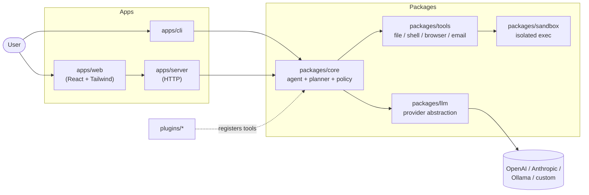

# OpenHand

**LLM-agnostic, plugin-first AI agent platform — sandboxed by default.**

[](./LICENSE)
[](https://github.com/Ricardo-M-L/openhand/actions/workflows/ci.yml)
[](./CHANGELOG.md)
[](https://www.typescriptlang.org/)
[](https://docs.npmjs.com/cli/v10/using-npm/workspaces)
[](./docker-compose.yml)
[](./CONTRIBUTING.md)

OpenHand is an open-source agent runtime you actually want to point at your
laptop: one provider-neutral LLM interface, a small set of audited tools, a
sandbox you can trust with `shell_exec`, and a plugin system that stays out
of core's way.

---

## Why OpenHand?

|                           | **OpenHand**                          | AutoGPT                     | CrewAI                      | LangChain Agents            |
| ------------------------- | ------------------------------------- | --------------------------- | --------------------------- | --------------------------- |
| Core lines of code        | Small, auditable `packages/core`      | Large, opinionated          | Medium                      | Very large meta-framework   |
| Sandbox by default        | Yes — `packages/sandbox`              | No                          | No                          | Optional                    |
| LLM provider lock-in      | None — `LLMProvider` interface        | OpenAI-first                | OpenAI-first                | Many, but heavy abstractions |
| Plugin story              | Manifest-driven, hot-registered       | Monolithic                  | Role-focused                | Chains / tools              |
| Interfaces shipped        | CLI + Web + HTTP server               | CLI                         | SDK                         | SDK                         |
| Typing                    | TypeScript strict, end-to-end         | Python                      | Python                      | Python / JS                 |

OpenHand is for builders who want **just enough framework** — an agent loop,
tool schema, policy, sandbox, LLM abstraction — and nothing you cannot read in
a weekend.

---

## Features

- **Provider-neutral LLM layer** — OpenAI, Anthropic Messages, and Ollama
  ship in-box through one `LLMProvider` interface, selected at runtime by
  `LLM_PROVIDER=...`. Every wire format is a tiny `fetch` wrapper — no
  vendor SDK, no drift.
- **Batteries-included client** — `LLMClient` wraps any provider with
  exponential-backoff retry, AbortController timeouts, a FIFO token-bucket
  rate limiter, and a cost tracker that accumulates prompt/completion
  tokens across calls.
- **Sandboxed tool execution** — filesystem, shell, network, and email tools
  all run through `packages/sandbox` with configurable roots, timeouts, and
  output limits. Shell metacharacters (`$()`, `;`, `|`, `>`) are rejected
  at parse time so a badly-trained model can't shell-escape.
- **Policy-gated actions** — allow, deny, or require human approval per tool
  and per argument pattern. The default policy is auditable in
  `packages/sandbox/src/policy.ts`.
- **Plugin-first with hot reload** — drop a folder under `plugins/`, declare
  an `openhand` manifest in `package.json`, and `PluginLoader` discovers it.
  `loader.watch()` uses `fs.watch` so edits reload without restarting.
- **Interactive CLI REPL** — `openhand chat` gives you `/help`, `/model`,
  `/reset`, `/save`, `/exit`, a native ANSI spinner, ctrl+c handling, and
  persistence to `~/.openhand/config.json` — all with zero extra deps.
- **Live web task stream** — `GET /api/tasks/:id/stream` is a real SSE feed
  with `Last-Event-ID` resume and a per-task ring buffer. `apps/web`'s
  Tasks page tails it in realtime.
- **Monorepo with npm workspaces** — `packages/{core,tools,sandbox,llm}` and
  `apps/{cli,server,web}`, each independently testable (120+ tests).
- **Dockerized web UI** — production-ready `apps/web` image served by nginx.

---

## Architecture



See **[`docs/ARCHITECTURE.md`](./docs/ARCHITECTURE.md)** for data flow and
module boundaries.

---

## Quickstart

### Option A — Docker (web UI + server)

```bash
git clone https://github.com/Ricardo-M-L/openhand.git
cd openhand
cp .env.example .env                 # fill in at least one LLM key
docker compose up --build
# Web:    http://localhost:3000
# Server: http://localhost:3001
```

### Option B — Local dev (all workspaces)

```bash
git clone https://github.com/Ricardo-M-L/openhand.git
cd openhand
cp .env.example .env
npm install
npm run build
npm run dev                          # CLI + server + web in parallel
```

Run only the CLI REPL:

```bash
npm --workspace @openhand/cli start
# or, after `npm run build`:
openhand chat
```

Inside the REPL:

```text
> /help
Available commands:
  /help             show this list
  /model <name>     switch model (also accepts "<provider>:<model>")
  /reset            clear history for the current session
  /save             persist config to ~/.openhand/config.json
  /exit             leave the REPL
> /model anthropic:claude-3-5-sonnet-latest
switched to anthropic/claude-3-5-sonnet-latest
> summarize CHANGELOG.md
(spinner...)
```

Watch a task from the web UI:

```bash
# Terminal 1
npm run dev:server
# Terminal 2
curl -N http://localhost:3001/api/tasks/demo-1/stream &
curl -X POST http://localhost:3001/api/tasks/demo-1/_demo
# -> streams 4 SSE events (pending → running → running → completed)
```

---

## Plugin system

Plugins live in `plugins/*`. Each plugin declares a manifest inside
`package.json` under the `openhand` key, exports tools, and is picked up
automatically at boot:

```text
plugins/calculator/
├── package.json       # { "openhand": { "id": "calculator", "entry": "./index.js" } }
├── index.js           # module.exports = { tools: [...], onEnable() {...} }
├── README.md
└── tests/calculator.test.js
```

Two example plugins ship in-tree:

- **`plugins/weather`** — minimal mock API to show the shape of a plugin.
- **`plugins/calculator`** — safe arithmetic evaluator (no `eval`, no
  `new Function`) that agents can call for math. 10 tests including
  `$()`/assignment/globals rejection.

Full guide: **[`docs/PLUGIN_DEVELOPMENT.md`](./docs/PLUGIN_DEVELOPMENT.md)**.

---

## Documentation

- [`docs/ARCHITECTURE.md`](./docs/ARCHITECTURE.md) — modules, data flow, diagrams.
- [`docs/PLUGIN_DEVELOPMENT.md`](./docs/PLUGIN_DEVELOPMENT.md) — ship a plugin in 10 minutes.
- [`docs/SECURITY_MODEL.md`](./docs/SECURITY_MODEL.md) — sandbox, policy, approvals.
- [`CONTRIBUTING.md`](./CONTRIBUTING.md) — dev setup, tests, PR flow.
- [`SECURITY.md`](./SECURITY.md) — how to report a vulnerability.
- [`CHANGELOG.md`](./CHANGELOG.md) — what shipped in each release.

---

## Contributing

PRs are welcome — see [`CONTRIBUTING.md`](./CONTRIBUTING.md). Good first issues
are labelled `good first issue` on the tracker. If you want to add an LLM
provider or a tool plugin, start there.

---

## License

[MIT](./LICENSE) — use it, fork it, ship it. Attribution appreciated but not
required.
