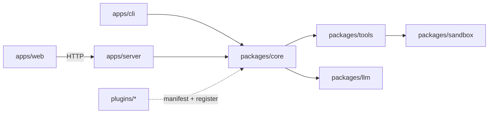
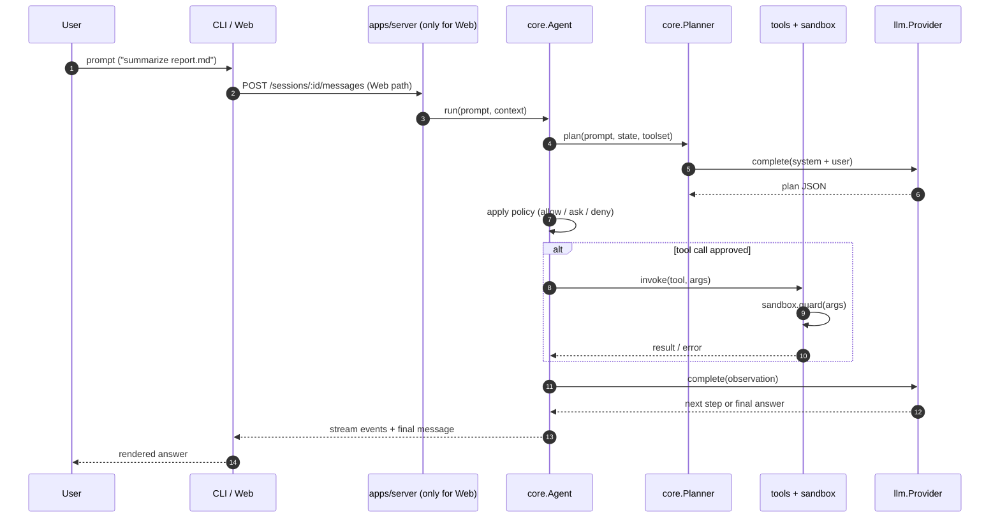

# OpenHand Architecture

This document explains how the OpenHand monorepo is laid out, what each
package / app is responsible for, and how a single user request flows through
the system.

---

## 1. Module map

```
openhand/
├── apps/
│   ├── cli/           interactive terminal UI, commands (chat/ask/exec/config)
│   ├── server/        HTTP API; owns agent session lifecycle for web clients
│   └── web/           React + Tailwind SPA, nginx-served in production
├── packages/
│   ├── core/          agent loop, planner, policy, types
│   ├── tools/         built-in tools (file, shell, browser, email, system)
│   ├── sandbox/       isolated execution (fs roots, timeouts, output caps)
│   └── llm/           LLMProvider abstraction + reference OpenAI-compatible impl
├── plugins/           third-party tool bundles loaded at boot
└── docs/              this directory
```

### Who depends on what



### Package responsibilities

| Package              | Responsibility                                                                                          | Non-goals                                     |
| -------------------- | ------------------------------------------------------------------------------------------------------- | --------------------------------------------- |
| `@openhand/core`     | Run the agent loop: plan, pick tool, call tool, observe, iterate. Enforce policy. Emit events.          | Talk to providers; touch the filesystem.      |
| `@openhand/llm`      | Provide `LLMProvider { complete, stream }`. Ship an OpenAI-compatible reference implementation.         | Agent logic; prompt engineering.              |
| `@openhand/tools`    | Define tool schemas + handlers for file, shell, browser, email, system.                                 | Decide *whether* to execute (that is policy). |
| `@openhand/sandbox`  | Execute a tool call with a confined filesystem, timeouts, output caps, and env scrubbing.               | Know what the tools mean.                     |
| `apps/cli`           | Terminal UI that instantiates core + tools + a provider, runs a session.                                | Persist state beyond local config.            |
| `apps/server`        | HTTP endpoints that accept prompts, stream events, manage approvals for web clients.                    | Render UI.                                    |
| `apps/web`           | SPA that talks to `apps/server`. Shows plan, tool calls, approvals, output.                             | Run tools directly.                           |
| `plugins/*`          | Extra tools packaged as manifest + code. Registered by `packages/core` at startup.                      | Modify core internals.                        |

---

## 2. Request lifecycle



Key properties:

1. **Planner** produces a structured plan; if the LLM returns malformed JSON,
   core falls back to a `direct_response` step (see
   `packages/core/tests/planner.test.ts`).
2. **Policy** sits between plan and tool execution. It can auto-allow safe
   calls, require approval for risky ones, or deny outright. See
   `docs/SECURITY_MODEL.md`.
3. **Sandbox** is the last line of defence. Even if policy allows, the
   sandbox still enforces filesystem roots, timeouts, and output size caps.
4. **LLM** is *always* behind `LLMProvider`. Core never imports a vendor SDK.

---

## 3. Data contracts

The important types live in `packages/core/src/types.ts` (tasks, plans,
messages) and `packages/llm/src/types.ts` (provider interface). Tools declare
their input schema using a Zod-style object (see `packages/tools/src`).

Versioning contract: types exported from `packages/core` are considered
public API and follow semver. Internal helpers are prefixed with `_`.

---

## 4. Extending OpenHand

Three common extension points, from least to most invasive:

1. **New tool inside an existing domain** — add a handler to `packages/tools`,
   add its schema, add tests. No changes to core required.
2. **Plugin** — self-contained bundle under `plugins/`. Good for anything
   vertical (weather, jira, slack, finance). Walkthrough in
   `docs/PLUGIN_DEVELOPMENT.md`.
3. **New LLM provider** — implement `LLMProvider` in `packages/llm`, export
   it, wire it into CLI/server config. Keep retry, tokenization, and tool-
   calling quirks inside your provider; do not leak them into core.

---

## 5. Performance & limits

- Every tool call runs under `SANDBOX_TOOL_TIMEOUT_MS` (default 15s).
- Output is capped by `SANDBOX_TOOL_MAX_OUTPUT_BYTES` (default 1 MiB).
- Planning + observation calls share the provider's timeout
  (`OPENHAND_LLM_TIMEOUT_MS`, default 30s).
- Concurrency inside a session is 1 by default (serial agent loop).
  Multi-session concurrency is handled by `apps/server`.

---

## 6. Observability

- Events from the agent loop are emitted on `core.Agent` via `eventemitter3`.
- `apps/server` fans them out via SSE so `apps/web` can render live.
- `LOG_LEVEL` and `LOG_JSON` env vars control log verbosity and format.
